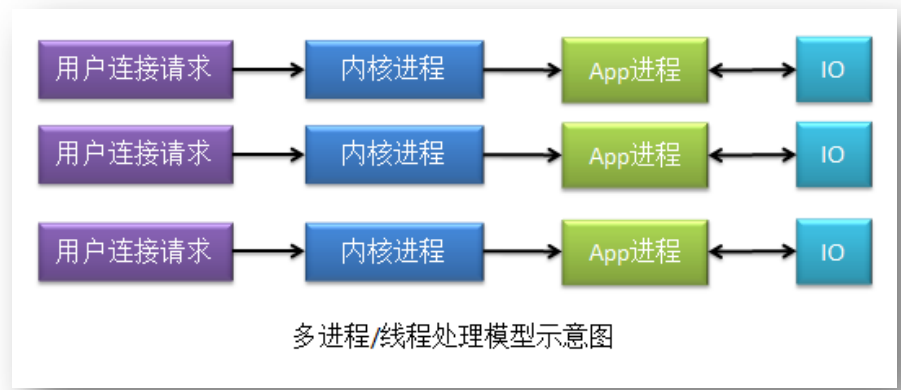

# nginx

Nginx (engine x) 是一个轻量级的高性能的基于 Http 的反向代理服务器,静态web服务器。

高并发:nginx 工作模式是master-worker进程方式，执行请求是有更轻量线程完成。     
低消耗    
热部署    
高可用:worker异常可以由其他worker接替    
高扩展:nginx upstream是在线程层面调度，兼容多种，所以可以扩展很多功能强大
易维护:主要的流程过程和模块分离清晰

## 代理

- 正向代理

正向代理主要的代理对象是用户客户端，代理服务器位于用户客户端与网站服务器之间，主要用于解决用户客户端的IP访问受限问题和网络安全性问题。

作用:

> 隐藏实际请求    
vpn,翻墙    
提速    
缓存    
授权    

- 反向代理

反向代理主要的代理对象是服务器服务端，为服务器在其适当的位置设置了代理，以充当真实的服务器，主要用于解决服务端的资源利用问题和服务器稳定性问题。

作用:

> 隐藏实际服务    
分布式路由    
负载均衡    
动静分离    
数据缓存

## 常用命令

nginx -h 查看命令选项

> nginx -v 显示nginx版本
nginx -V 显示nginx及其关联软件版本    
nginx -t 测试配置文件是否正确,默认文件位置conf/nginx.conf    
nginx -T 测试配置文件是否正确并显示配置文件    
nginx -tq 配置文件测试过程中,只显示错误信息    
nginx -p prefix     : set prefix path (default: /usr/local/openresty/nginx/)    
nginx -e filename   : set error log file (default: logs/error.log)    
nginx -c filename   : set configuration file (default: conf/nginx.conf)    
nginx -g directives : set global directives out of configuration file    

## 实现机制

### 零拷贝 Zero Copy

零拷贝指的是，从一个存储区域到另一个存储区域的 copy 任务没有 CPU 参与。简单说就是一种不需要CPU参与文件复制的文件读写方式.零拷贝通常用于网络文件传输，以减少 CPU 消耗和内存带宽占用，减少用户空间与 CPU 内核空间的拷贝过程，减少用户上下文与 CPU 内核上下文间的切换，提高系统效率。    
用户空间指的是用户可操作的内存缓存区域，CPU 内核空间是指仅 CPU 可以操作的寄存器缓存及内存缓存区域。用户上下文指的是用户状态环境，CPU 内核上下文指的是 CPU 内核状态环境。    
零拷贝需要 DMA 控制器的协助。DMA，Direct Memory Access，直接内存存取，是 CPU的组成部分，其可以在 CPU 内核（算术逻辑运算器 ALU 等）不参与运算的情况下将数据从一个地址空间拷贝到另一个地址空间

web文件读取流程:    

文本读取的常用方式:    
> 1 仅CPU方式    
2 CPU&DMA方式    
3 零拷贝方式: mmap+write、sendfile、sendfile+DMA收集、splice等

这里只列举读取操作流程,正常情况下写操作与读操作步骤相同

- 仅CPU方式

单读取操作需要两次cpu上下文切换(用户态,内核态),两次数据复制.读写操作需要4次上下文切换,4次数据复制

- CPU&DMA方式    

直接内存访问（Direct Memory Access），是一种硬件设备绕开CPU独立直接访问内存的机制。所以DMA在一定程度上解放了CPU，把之前CPU的杂活让硬件直接自己做了，提高了CPU效率。目前支持DMA的硬件包括：网卡、声卡、显卡、磁盘控制器等。

这种方式避免了CPU与低速的硬盘间的交互,提高了CPU的使用效率,但单次读取依旧需要两次cpu上下文切换(用户态,内核态),两次数据复制.读写操作需要4次上下文切换,4次数据复制

一次完成的数据交互包括几个部分：系统调用syscall、CPU、DMA、网卡、磁盘等。
系统调用syscall是应用程序和内核交互的桥梁，每次进行调用/返回就会产生两次切换：    
> 调用syscall 从用户态切换到内核态
syscall返回 从内核态切换到用户态

系统调用流程:    

完整的数据复制流程:    

读数据过程：

> 应用程序要读取磁盘数据，调用read()函数从而实现用户态切换内核态，这是第1次状态切换；
DMA控制器将数据从磁盘拷贝到内核缓冲区，这是第1次DMA拷贝；
CPU将数据从内核缓冲区复制到用户缓冲区，这是第1次CPU拷贝；
CPU完成拷贝之后，read()函数返回实现用户态切换用户态，这是第2次状态切换；

写数据过程：

> 应用程序要向网卡写数据，调用write()函数实现用户态切换内核态，这是第1次切换；
CPU将用户缓冲区数据拷贝到内核缓冲区，这是第1次CPU拷贝；
DMA控制器将数据从内核缓冲区复制到socket缓冲区，这是第1次DMA拷贝；
完成拷贝之后，write()函数返回实现内核态切换用户态，这是第2次切换；

综上所述：

> 读过程涉及2次空间切换、1次DMA拷贝、1次CPU拷贝；
写过程涉及2次空间切换、1次DMA拷贝、1次CPU拷贝；
可见传统模式下，涉及多次空间切换和数据冗余拷贝，效率并不高，接下来就该零拷贝技术出场了。

- 零拷贝方式: 

传统的复制方式需要CPU进行内核缓冲区到用户缓冲区的进行多次用户态和内核态的切换,如果用户不进行数据修改,那么CPU只是单纯进行复制操作,加重了CPU的负担.因为数据一直是那个数据.又不花钱,总是左右兜来放,手也太闲了,它本可以干更多事.为了避免冗余的数据复制,解放CPU,就需要零拷贝技术.

3.1 mmap+write

通过内存映射文件,实现内核缓冲区地址与用户缓冲区地址的映射,实现缓冲区数据共享,避免了一次内核缓冲区与用户缓冲区数据的复制.    

适合大文件传输,但是小文件可能出现碎片,同时多进程同时操作文件时可能引发coredump的signal.
节省了一次内核缓冲区复制到用户缓冲区的操作,但是依旧需要内核缓冲区复制到套接字缓冲区.读写操作需要4次上下文切换,3次数据复制

3.2 sendfile

Linux 内核2.1版本中,sendfile方式只使用一个函数就可以完成之前的read+write 和 mmap+write的功能，这样就少了2次状态切换，由于数据不经过用户缓冲区，因此该**数据无法被修改**。

应用程序只需要调用sendfile函数即可完成,读写操作需要2次上下文切换,3次数据复制(1次CPU拷贝、2次DMA拷贝)

3.3 sendfile+DMA收集

Linux 2.4 内核对 sendfile 系统调用进行优化.升级后的sendfile将内核空间缓冲区中对应的数据描述信息（文件描述符、地址偏移量等信息）记录到socket缓冲区中。DMA控制器根据socket缓冲区中的地址和偏移量将数据从内核缓冲区拷贝到网卡中，从而省去了内核空间中仅剩1次CPU拷贝。

读写操作需要2次上下文切换,2次数据复制(0次CPU拷贝、2次DMA拷贝)，但是仍然无法对数据进行修改，并且需要硬件层面DMA的支持，并且sendfile只能将文件数据拷贝到socket描述符上，有一定的局限性。

3.4 splice

splice系统调用是Linux 在 2.6 版本引入的，其不需要硬件支持，并且不再限定于socket上，实现两个普通文件之间的数据零拷贝。splice 系统调用可以在内核缓冲区和socket缓冲区之间建立管道来传输数据，避免了两者之间的 CPU 拷贝操作。**不支持修改**

splice也有一些局限，它的两个文件描述符参数中有一个必须是管道设备。读写操作需要2次上下文切换,2次数据复制(0次CPU拷贝、2次DMA拷贝)

- 扩展阅读

[彻底搞懂零拷贝（Zero-Copy）技术](https://zhuanlan.zhihu.com/p/362499466)

### 多路复用器 select|poll|epoll

- 多进程/多线程连接处理模型    

在该模型下，一个用户连接请求会由一个内核进程处理，而一个内核进程会创建一个应用程序进程，即 app 进程来处理该连接请求。应用程序进程在调用 IO 时，采用的是 BIO 通讯方式，即应用程序进程在未获取到 IO 响应之前是处于阻塞态的。
该模型的优点是，内核进程不存在对app进程的竞争，一个内核进程对应一个app进程.    
缺点:每个app进程都需要占用一个内核进程,存在资源上限.不适合高并发场景

- 多路复用连接处理模型

在该模型下，只有一个 app 进程来处理内核进程事务，且 app 进程一次只能处理一个内核进程事务。故这种模型对于内核进程来说，存在对 app 进程的竞争.    
多路复用器使用select、poll 与 epoll等算法判断内核进程的状态是否就绪,如果就绪就会告诉app进程,app进程将执行该内核进程的任务,如果遇到IO,会采用NIO模式执行其他任务,当IO结果返回时,app进程停止当前事务,将IO结果返回给对应的内核进程,然后继续执行暂停的线程.

#### select

采用轮询方式查看内核进程状态.如果状态为就绪则将它放入就绪队列.app进程处理进程事务前会将内核空间用户连接请求相关数据复制到用户空间.    
缺点:    
> 轮询效率低.内核进程只有少数处于就绪状态    
就绪队列由数组实现,存在数量上限.所以有最大并发连接数限制    
内核空间到用户空间切换,系统开销大

#### poll

实现机制一致,只是将就绪队列实现方式改为链表.避免了最大并发数限制.

#### epoll

内核状态判断机制由轮询改为回调.内核进程就绪后主动回调epoll多路复用器,epoll将其放入就绪链表.所以也被称为epoll事件驱动模型.    
采用mmap零拷贝映射内核空间和用户空间,避免了cpu上下文切换    
优化了epoll处理内核进程就绪消息机制.它有LT,ET两种模式.    
> LT,Level Triggered，水平触发模式。若内核进程就绪消息未被处理,内核进程会定时发送就绪消息到epoll,直到被处理为止.通讯方式:BIO,NIO
ET,Edge Triggered，边缘触发模式。内核进程只发生一次就绪消息.通信方式:NIO

### nginx的并发处理机制

一般情况下并发处理机制有三种：多进程、多线程，与异步机制。Nginx 对于并发的处理同时采用了三种机制。当然，其异步机制使用的是异步非阻塞方式。   
多进程: master进程和master可创建多个worker进程;    
多线程: 每个worker进程可以为每个用户请求创建一个线程进行处理
异步非阻塞: worker 进程采用的就是 epoll 多路复用机制来对后端服务器进行处理的。当后端服务器返回结果后，后端服务器就会回调 epoll 多路复用器，由多路复用器对相应的 worker 进程进行通知。此时，worker 进程就会挂起当前正在处理的事务，拿 IO 返回结果去响应客户端请求。响应完毕后，会再继续执行挂起的事务

## 参数优化

nginx相关资料